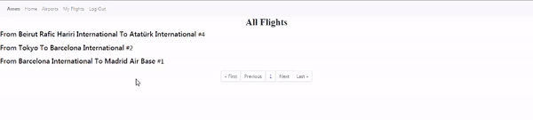

# Airport ✈

> GIF declaring how the web works

---

## Description

 Airport is a web application where user can check flights, their destination, origin and passengers number. User can also checks airports, which flights are going to and from this airport. \
 The user is able to book seat on flight and cancel booking too.

#### What i have used

- HTML
- Css
- Python
- Django
- Bootstrap

[Back To The Top](#airport-✈)

---

## How To Use

- ### Home
 It shows all flights in a specific Formula which is *(From -airport- To -airport- #-number-)*. I used the *hover selector*  on *-airport-* and *#-number-* because it will make it easier to distinguish.

 - When user clicks on:

   - *-airport-*: he will get redirected to this specific airport page, it shows all flights from and to this airport.

    - *#number*: he will get redirected to that flight page, he can book a seat or cancel booking, and he can see the passengers number on this flights

- ### Airports
  It shows all airports with their **IATA** code, and by clicking on the airport name he will be redirected to this airport page

- ### My Flights
  It shows the flights that user has booked on

[Back To The Top](#airport-✈)

---
