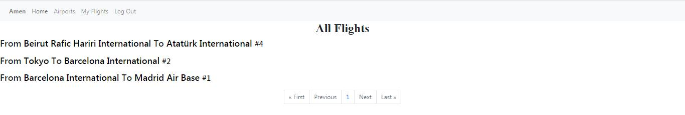
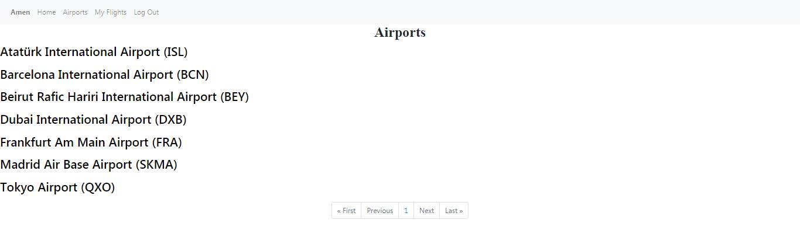

# Airport
I designed a web application where user can check airports, flights, book/cancel seat.
After user login, the *Home* page will be shown, it has all flights in a specific Formula which is *(From -airport- To -airport- #-number-)*
 \
I used the *hover selector*  on *-airport-* and *#-number-* because it will make it easier to distinguish.\
When user clicks on *-airport-* he will get redirected to that airport page which have all flights from and to this airport
 \
User can also reach a specific airport page by clicking on *Airports* in the navbar, it will give him a page with all airports, and by clicking on one of them he will get redirected to the same airport specific page.\
 \
By clicking on *#-number-* at the end of every flight, he will go to this specific flight page, it will show him *origin, destination, book seat or cancel booking(it depends if he has booked a seat or not),  and the number of passengers on this flight*\
 \
The work of *My Flights* in the navbar is clear, it will shows the user all flights he booked on.
